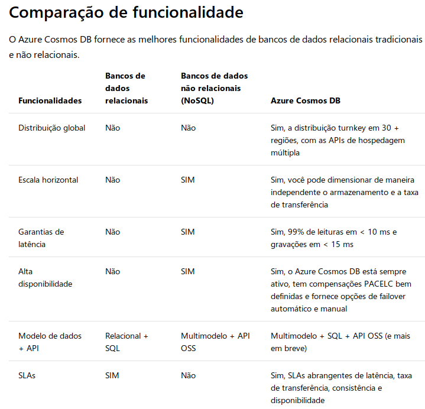
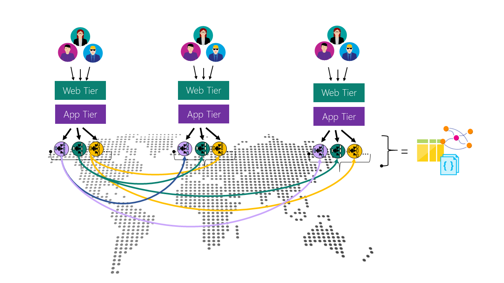

CosmosDB
===

História
---

Propriedade: Microsoft
Ambiente: Cloud (Azure)
Definição: Multimodelo de BD distribuído **globalmente**

- Dimensionar recursos elasticamente e **geograficamente**:
  - Taxa de transferência
  - Armazenamento
- Único no mundo a oferecer:
  - Garantia de taxa de transferência
  - Disponibilidade
  - Latência
  - Consistência com SLA abrangente
- Tipos de Modelos:
  - [Chave-Valor](# "Valor Principal")
  - [Colunar](# "Família da Coluna")
  - [Documentos](# "Documentos")
  - [Grafos](# "Graph")
- Vantagens:
  - Distribuição Global
  - Expansão elástica
  - Baixa latência garantida
  - Cinco modelos de consistência
  - SLAs abrangentes
- Feito para aplicativos escaláveis e altamente responsivos em escala global
  - Distribuição Global Turnkey
    - Distribuição dos dados para qualquer número de regiões do Azure. O dados onde os usuários estão, garantindo menor latência possível
    - [APIs de hospedagem múltipla](# "multihoming"). o aplicativo sempre sabe qual é a região mais próxima e envia solicitações ao data center mais próximo. Transparentemente. Definindo uma regiões de gravação e todas de leitura que quiser
    - Adicionar ou remover regiões não implica em manutenção dos aplicativos, continuanfo altamente disponível, graças à capacidade da API de várias home pages
  - Vários modelos de dados e APIs populares para acessar e consultar dados.
    - Modelos de dados baseados em ARS (Sequência de Registros Atom) é compatível nativamente com vários modelos de dados. Compatível com:
      - Chave-Valor
      - Colunar
      - Documentos
      - Grafos
      - Tabelados
    - APIs:
      - SQL: BD JSON schema-less com recursos de consultas SQL.
      - MongoDB: MongoDB as a service altamente escalável, compatível com suas ferramentas e bibliotecas.
      - Cassandra: bis
      - Gremlin: Graph Base totalmento gerenciado e escalável
      - Tabelas: Chave-valor, indexação automática, garantia de baixa latência, distribuição global.
      - More comming
  - Dimensionar elasticamente a taxa de transferência e o armazenamento sob demanda globalmente
    - Dimensionamento da taxa de transferência por segundo
    - Dimensionamento de armazenamento automático
  - Alta disponibilidades
    - SLA de 99,99% para 1 região e 99,999% para várias
    - Implantação em qualquer número de regiões, para maior disponibilidade e desempenho
    - Definição de prioridades por região dinâmicamente
    - Simulação de falhas em várias com garatia de perda de dados, para teste de disponibilidade
  - Escrever aplicativos globalmente de maneira correta
    - Cinco modelos de consistência
  - Garantida de dinheiro de volta
    - "Os principais contratos de nível de serviço (SLAs), abrangentes e com suporte financeiro, para disponibilidade, latência, taxa de transferência e consistência para seus dados essenciais."
  - Sem gerenciamento de esquema/índice de BD
    - "Itere rapidamente o esquema do seu aplicativo sem se preocupar com o esquema do banco de dados e/ou com o gerenciamento de índice."
    - Banco de dados idenpendente de schema
    - Indexação automática, sem necessidade de schema ou índice, com consultas incrivelmente rápidas

Soluções que se beneficiam do Azure Cosmos DB

Qualquer aplicativo Web, móvel, de jogos ou IoT que precisa lidar com grandes quantidades de dados, lê e escreve em uma escala global com tempos de resposta quase reais para uma variedade de dados, se beneficiarão da alta disponibilidade, alta taxa de transferência, baixa latência e consistência ajustável garantidas do Azure Cosmos DB. Saiba como o Azure Cosmos DB pode ser aplicado a IoT e telemática, varejo e marketing, jogos, Web e aplicativos móveis.

???
---

Regiões Geográficas  
Modelos de Consistência

References
---

https://docs.microsoft.com/pt-br/azure/cosmos-db/introduction

CosmosDB 2
===

Definição
---

- Serviço de dados distribuído
- Suporte nativo para NoSQL
- Microsoft Azure
- Modelos de consistência bebm definidos
- Garante latência de um digito de milissenfo no 99º percentil
- Garante alta disponibilidade
- Funcionalidades de hospedagem múltipla
- Baixa latência em qualquer lugar do mundo
- Suporte por SLAs
- Projetado para rodar em nuvem (onCloud x forCloud)
  - Preparado para solucionar problemas de escalabilidade
  - Preparado para ser extremamente rápido
- Escalável em poucos cliques
- Pensado desde o início para ser rápido e moderno
- Também funciona com tecnologias open source como React(mobile) e Node.js
- Indexação automática de todos os dados

Distribuição Global
---

### Garantias

- Consistência bem definidas
- Garantia de latência
- Alta disponibilidade
- Funcionalidades de hospedagem múltiplas
- Baixa latência em qualquer lugar

### Consistência

- Modelo de programação vem definido permite que a interpretação da consistência dos dados replicados seja simples
- Modelos de consistência trabalham de forma independente da região, tanto na leitra quanto na escrita.
- INDEPENDENCIA
- Nível de consistência personalizável
- Nível de consistência pode ser determinado pelo desenvolvedor da aplicação
- "Uma requisição de leitura só é considerada finalizada, se todas as garantias de consistência associadas com o nível de consistência determinado são satisfeitas."

### Multimodelos e API

- Trabalhar com diferentes tipos de dados em um mesmo serviço. (Incomum)
- Modelos:
  - Chave-Valor
  - Grafo
  - Colunar
  - Documentos
- APIs:
  - SQL
  - Javascript
  - Gremlin
  - MongoDB
  - Cassandra
  - Tabelas do próprio Azure
- Funcionalidades:
  - Procedures
  - Triggers
  - UDFs (Javascript)
  - Lógica da aplicação sendo executada direto no Banco
- Tipo de Dado:
  - JSON
  - Transações Atômicas
  - Encapsulamento 
  - " O encapsulamento é algo bem interessante para ser entendido, principalmente se você trabalha com microsserviços e/ou programação reativa (react). O encapsulamento permite armazenar procedures e agrupar a lógica de negócio em um único local, o que nos permite adicionar uma camada de abstração sobre os dados, protegendo nossa aplicação e melhorando sua performance."

### Aplicações

- IoT e Telemetria
  - Consumo de Sensores (semáfores, acidentes, vias interditadas)
  - Distribuição por região (cidade)
  - Controle de Tráfego
  - Processamento e análise em tempo real
- E-commerce
  - Armazenamento de catálogos
  - Processamento de pedidos
- Eventos
 - Azure Functions
 - Node.js

Referências
---

https://www.microsofttech.com.br/open-source-trabalhando-com-programacao-reativa-e-azure-cosmosdb/?wt.mc_id=AID636721_QSG_BLOG_229275
https://www.microsofttech.com.br/vamos-falar-de-cosmosdb/

CosmosDB 3
===

Distribuição Global
---

- Azure é universal com mais de 50 regiões geográficas (em expansão)
- Criar, Implantar e Gerenciar aplicativos distribuídos globalmente com facilidade

Oferece:
  - Multimodelo
  - Distribuição local
  - Suporte para aplicativos Críticos
  - Distribuição global turnkey
  - [dimensionamento elástico da produtividade e do armazenamento](https://docs.microsoft.com/pt-br/azure/cosmos-db/partition-data)
    -
    -
    -
    -
  - Latência de milisegundo de um dígito de leitura e gravação a 99%
  - [modelos de coerência bem-definidos](https://docs.microsoft.com/pt-br/azure/cosmos-db/consistency-levels)
  
    - Forte: Transação Atômica (Garante a versão mais recente do dados)
    - Consistência Amena: "Fornecem menos consistência de alta segurança, que é o modelo mais consistente disponível"
      - **Desatualização Limitada:** Prefixo Consistente ("Lê latência por trás de gravações por meio de prefixos k ou intervalos t, no máximo")
      - **Sessão:** Prefixo Consistente ("Leituras monotônicas, gravações monotônicas, read-your-writes (operações de leitura refletem gravações anteriores), write-follows-reads (gravações são propagadas após as leituras)")
      - **Prefixo Consistente:** As atualizações retornadas são algum prefixo de todas as atualizações, sem intervalos
      - Eventual: Leitura fora de ordem
      - **exclusivos**
      - Outros bancos: Não oferece opção de consistência ou oferece Forte e Eventual.
    - Escolher o nível de consistência em tempo de execução
    - 
  - [Verificador de Transição Atômica](http://dl.acm.org/citation.cfm?id=1806634)
    -
    -
    -
    -
  - Garantia de alta disponibilidade
  - [SLAs abrangentes líderes do setor](https://azure.microsoft.com/support/legal/sla/cosmos-db/)
    -
    -
    -
    -
  - [indexa automaticamente todos os seus dados](http://www.vldb.org/pvldb/vol8/p1668-shukla.pdf)
    -
    -
    -
    -
  - Não necessita lidar com gerenciamento de esquemas e índices
-Distribuição global multimaster

???
---

Distribuição Global Turnkey = "Como aprendemos durante a criação do Azure Cosmos DB, a adição da distribuição global não pode ser uma consideração posterior. Ela não pode ser “forçada” em um sistema de banco de dados de “site único”. As funcionalidades oferecidas por um banco de dados distribuído globalmente estendem-se além das oferecidas por uma Geo-DR (recuperação de desastre geográfica) tradicional dos bancos de dados de "site único". Bancos de dados de site único que oferecem a capacidade de Geo-DR são um subconjunto restrito de bancos de dados distribuídos globalmente.

Com a distribuição global turnkey do Azure Cosmos DB, os desenvolvedores não precisam criar seu próprio scaffolding de replicação empregando o padrão Lambda no log do banco de dados ou realizando "gravações duplas" em várias regiões. Não recomendamos essas abordagens, pois é impossível garantir sua exatidão e fornecer SLAs robustos."